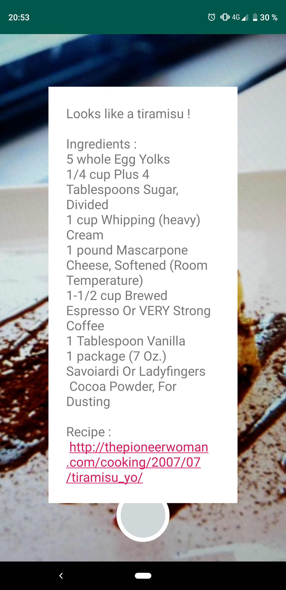

# CookThis
See it, scan it, cook it ! CookThis is an Android app that identifies dishes, lists their ingredients and gives you the corresponding recipe. Just take a picture of a meal and learn how to cook it !

 

To identify different types of food, CookThis uses a [MobileNetV2](https://tfhub.dev/google/imagenet/mobilenet_v2_100_224/classification/3) model, re-trained on a subset of the [Food-101](https://www.vision.ee.ethz.ch/datasets_extra/food-101/) dataset, and converted to [Tensorflow Lite](https://www.tensorflow.org/lite) for mobile inference on Android. Recipes are from the [Open Recipes Database](https://github.com/fictivekin/openrecipes).